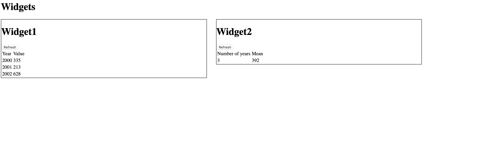

# Exercises

In this course we are going to progresively build a Dashboard-application,
which we will extend as we learn new things.

The dashboard will take data from a server, and display it on a dashboard
in multiple formats.

---
# Exercise 1

In this exercise we will create a couple of base components, that takes data
and renders them on screen. When done, we should have

* app.component - Base component
* dashboard.componnet: Renders list of Widgets on Dashboard
* widget.component: Renders a widget on the Dashboard

----
In the end, it should look like this.


----
Step one, clone this angular repository

```
git clone the repo
and make sure that it runs
cd dashboard_demo
npm install
npm run start
```

Then navigate to dashboard_demo in your favourite editor. 
----
Step two, create a new component in app/ called dashboard.
The component should consist of a typescript/html and css-file.

Take a look at app.component.ts if this looks confusing.

----
Step three,
In your new component, define an Interface to fetch WidgetData.
Then use the helper found in data_helpers to load mocked data.

```
import {loadData, Data} from '../utils/data_helpers'

interface WidgetData {
    name: string;
    type: string;
    data: Data;
};
@Component({
  selector: 'dashboard-component',
  templateUrl: './dashboard.component.html',
  styleUrls: ['./dashboard.component.css']
})
export class DashboardComponent {
    widgetData: WidgetData = loadData()
}
```
----
Step four,
Create a new component called widget.

The widget should take three inputs (you remember @Input right?)

* name, type and Data

The component should also have one event called refresh (Using @Output)
----

In the Widget View, render the data.

* If type === table, render a table of year/values.
* If type === Mean, render a widget that shows two values. Number of years, Mean-value.
----
Now, add an event listener for the refresh @Output.
When pressed, dashboard.component should load new data.
----
Last step. 

* Add your new components to **declarations** in app.module.ts
* Render the Dashboard Component in App
* In Dashboard, render one Widget component for each value in widgetData
----
If it looks like this, you've made it!


